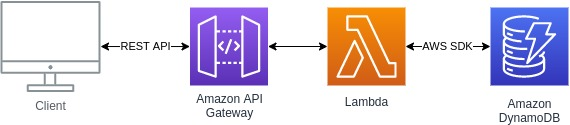

# Lead API Hiring Coders 2021 - grupo 25

## 👨🏻‍💻 Sobre o desafio

- 
Desenvolver um projeto com o uso de API, sendo que os grupos serão divididos em 3 apresentações (em datas diferentes para bancas diferentes)!
- O projeto deverá ser o mesmo para os 3 grupos, o que muda é a temática da API que eles vão puxar, que deve estar relacionada com o mercado de cada patrocinador!! Sendo eles:
  - [AWS](https://aws.amazon.com/pt/) 
  - [ACCT](https://acct.global) 
  - [Corebiz](https://www.corebiz.ag/pt/)

### Repositório do projeto
https://github.com/victorhgadioli/hiringcoders2021-finalChallenge-main

### 💻 Desenvolvedores
- [André Moraes](https://github.com/andreLTMoraes)
- [Anna Laura](https://github.com/alauraivani)
- [Cristiano Souza Santana](https://github.com/CristianoSantan)
- [Fabiano Pereira](https://github.com/ifabianoi)
- [Maria (Marrô) Rosa Müller ](https://github.com/Marro-Muller)
- [Otávio Cleyderman Ferraz Faria](https://github.com/OtavioCleyderman)
- [Pedro Laranjeira](https://github.com/pedroasso)
- [Reginaldo Oliveira](https://github.com/Reginaldo007oliveira)
- [Victor Martins](https://github.com/VictorFerreiraMartins)
- [Victor Hugo Gadioli](https://github.com/victorhgadioli)

## Introdução

Este documento irá te ajudar a navegar na API criada para o desafio final do Hiring Coders 2021. Foi desenvolvida pelo grupo 25.

Neste repositório você também irá encontrar as funções lambdas utilizadas para tratar as entradas em nosso banco de dados AWS DynamoDB.

## 🚀 Tecnologias

Tecnologias que utilizamos para desenvolver esta API Rest:

- [AWS DynamoDB](https://aws.amazon.com/pt/dynamodb/)
- [AWS API Gateway](https://aws.amazon.com/pt/api-gateway/)
- [AWS Lambda](https://aws.amazon.com/pt/lambda/)

## Estrutura da API 

</img>

## Selecionando a informação chave
Ao decorrer do projeto, tivemos que decidir qual informação do lead seria utilizada como chave (única no banco) para requisições no banco de dados. Inicialmente foi selecionado o email como informação chave. Com o projeto quase finalizado, alteramos a informação chave para telefone para facilitar a interação com as APIs da VTEX.

Neste momento, existem dois métodos de interagir com o banco de leads, por meio do email ou telefone. AMbos dividem o mesmo URL, porém no final deste, você deve escolher :

- /byphone - interage com o telefone como informação chave
- /byemail - interage com o email como informação chave
  
## POST  

	
### Descrição  
	
Esta requisição cria customers como lead ou cliente. Caso tente-se criar um customer como client e este já existir como lead, haverá uma alteração de tipo. A procura do customer no banco de dados é feito baseado na informação chave inserido, portanto este campo é obrigatório e único no banco.

### Atributos
    {
       "payload": {
          "Item": {
             "name": "(inserir nome aqui)",
             "phoneNumber": "(inserir telefone aqui)",
             "email": "(inserir email aqui)",
             "type": "(inserir lead/client)"
          }
       }
    }

**name** - nome do customer (opcional)  
**phoneNumber** - telefone (obrigatório caso utilize a rota **/byphone**) 
**email** - email (obrigatório caso utilize a rota **/byemail**)  
**type** - tipo de customer [lead ou client] (obrigatório)  

### Respostas

 **1. Item válido e adicionado ao bando de dados**
 
 ### Entrada 
    {
	   "payload": {
          "Item": {
             "name": "João A",
             "phoneNumber": "11 1111-11111",
             "email": "joaoa@email.com",
             "type": "lead"
          }
       }
    }
    
  ### Saída

    {
       "statusCode": 201,
       "body": "Customer created!"
    }
  
**2. Item válido mas já existe na tabela (email ou phoneNumber já cadastrado)**
  ### Saída

    {
       "statusCode": 409,
       "body": "Customer already exists!"
    }

**3. Item válido e já existe na tabela como lead, e será adicionado como client**
 ### Saída

    {
       "statusCode": 202,
       "body": "Customer is now a client!"
    }
    
**4. Caso haja algum erro na API durante operações no banco de dados**
 ### Saída

    {
       "statusCode": 400,
       "body": "Error during database operation!"
    }

  
## GET  

	
### Descrição  
	
Esta requisição altera permite você buscar um customer ou todos. A procura por um customer no banco de dados é feito baseado na informação chave inserida, portanto este campo é obrigatório e único no banco. Para buscar todos os customer, coloque o caracter * no lugar da informação chave.

### Passagem
Há a possibilidade de interagir com a API para com a URL sem a necessidade de uma estrutura json no corpo da requisição. Caso queira obter todos os customers, adicione no final do URL "**/***". Caso queria receber apenas um customer, adicionar a informação chave do customer que deseja no fim do URL "/**{informação chave do customer}**".

### Atributos
    {
       "payload": {
          "Item": {
             "email/phoneNumber": "(inserir email/phoneNumber ou * aqui)",
          }
       }
    }
    
**phoneNumber** - telefone (obrigatório caso utilize a rota **/byphone**) 
**email** - email (obrigatório caso utilize a rota **/byemail**)  

### Respostas

 **1. Todos os customers**
 
 ### Entrada 
    {
	   "payload": {
          "Item": {
             "email": "*"
          }
       }
    }
    
  ### Saída

    {
       "statusCode": 200,
       "body": [           (lista customers)
          {...}, 
          {...},
          ...
       ]
    }
  
**2. Email existente no banco de dados**
 
 ### Entrada 
    {
	   "payload": {
          "Item": {
             "email": "joaoa@email.com"
          }
       }
    }
    
  ### Saída

    {
       "statusCode": 200,
       "body": [
          {
             "phoneNumber": "22 2222-22222",
             "clientAt": "1630095395715",
             "updatedAt": "1630095912750",
             "createdAt": "1630095239814",
             "email": "joaoa@email.com",
             "id": "4a3b65a2-cd17-4ddf-8106-02ae949f6248",
             "name": "João B",
             "leadAt": "1630095239814",
             "type": "client"
          }
       ]
    }
   
**3. Email inexistente no banco de dados**
 ### Saída

    {
       "statusCode": 404,
       "body": "No customer found!"
    }

  
## PUT  

	
### Descrição  
	
Esta requisição altera o nome ou telefone do customer. A procura do customer no banco de dados é feito baseado na informação chave inserida, portanto este campo é obrigatório e único no banco. Para o put ser efetivo, deve-se adicionar pelo menos um dos campos name, email ou phoneNumber sendo estes não a informação chave.  
**Importante: A informação chave não pode ser alterada.  
Importante: Caso queira mudar de tipo de customer de *lead* para *client*, utilizar a requisição POST**
### Atributos
    {
       "payload": {
          "Item": {
             "name": "(inserir nome aqui)",
             "phoneNumber": "(inserir telefone aqui)",
             "email": "(inserir email aqui)",
          }
       }
    }

**name** - nome do customer (opcional)  
**phoneNumber** - telefone (obrigatório caso utilize a rota **/byphone**) 
**email** - email (obrigatório caso utilize a rota **/byemail**)  

### Respostas

 **1. Email existente no banco de dados e alterações**
 
 ### Entrada 
    {
	   "payload": {
          "Item": {
             "name": "João B",
             "phoneNumber": "22 2222-22222",
             "email": "joaoa@email.com"
          }
       }
    }
    
  ### Saída

    {
       "statusCode": 202,
       "body": "Customer updated!"
    }
  
**2. Email inexistente no banco de dados e alterações**
  ### Saída

    {
       "statusCode": 404,
       "body": "Customer not found!"
    }
   
**3. Caso haja algum erro na API durante operações no banco de dados**
 ### Saída

    {
       "statusCode": 400,
       "body": "Error during database operation!"
    }

  
## DELETE  

	
### Descrição  
	
Esta requisição permite deletar um customer do banco de dados permanentemente. A procura por um customer no banco de dados é feito baseado na informação chave, portanto este campo é obrigatório e único no banco.

### Passagem
Há a possibilidade de interagir com a API para com a URL sem a necessidade de uma estrutura json no corpo da requisição. Caso queira deletar um customer, adicionar a informação chave do customer que deseja deletar no fim do URL "**/{informação chave do customer}**".

### Atributos
    {
       "payload": {
          "Item": {
             "email": "(inserir email aqui)",
          }
       }
    }
**phoneNumber** - telefone (obrigatório caso utilize a rota **/byphone**) 
**email** - email (obrigatório caso utilize a rota **/byemail**)  

### Respostas

 **1. Email existente no banco de dados**
 
 ### Entrada
    {
	   "payload": {
          "Item": {
             "email": "joaoa@email.com"
          }
       }
    }
    
  ### Saída

    {
       "statusCode": 202,
       "body": "Customer deleted!"
    }
  
**2. Email inexistente no banco de dados**
   
  ### Saída

    {
       "statusCode": 404,
       "body": "Customer not found!"
    }
  

